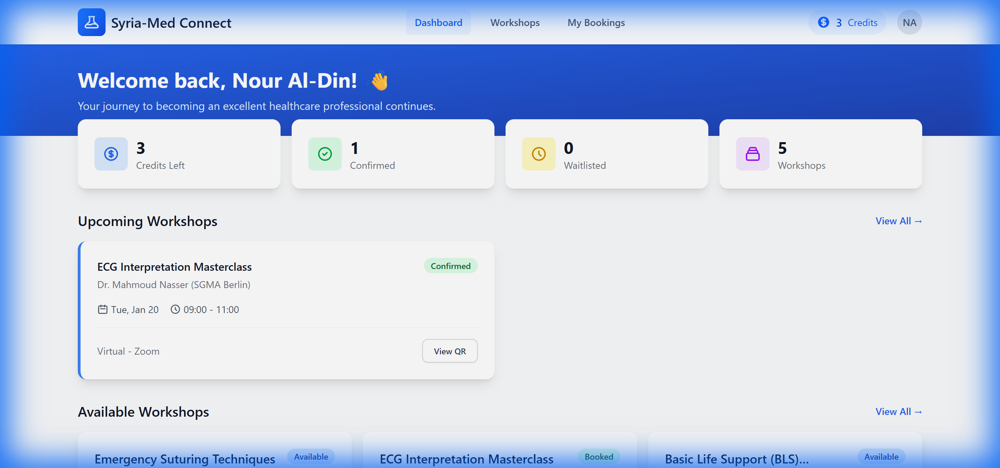
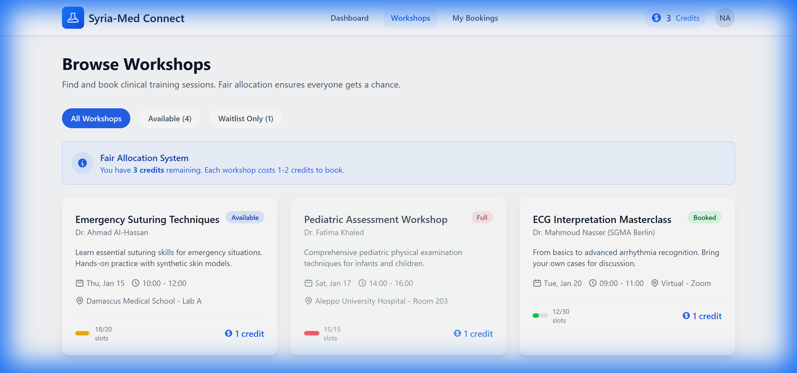
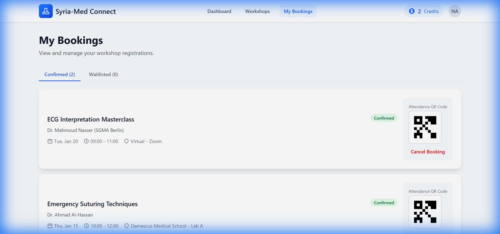

# Syria-Med Connect Platform

> **Proposal Submission: ABJAD-EDU-MED-003/2025**  
> **Submitted By:** Global Health Mentorships (GHMe) Consortium  
> **Date:** December 31, 2025

---

## 🎯 Executive Summary

**Syria-Med Connect** is an **Offline-First Progressive Web Application (PWA)** designed to revolutionize medical education in post-conflict Syria. This platform addresses the critical challenges outlined in the Abjad Educational Initiative RFP:

- **70% Brain Drain** of medical professionals
- **Fragmented Educational Infrastructure**
- **Unreliable Internet Connectivity**
- **Scarce Clinical Training Resources**

Our solution provides a resilient, mobile-first platform that enables medical students to access education **even when the power cuts out**.

---

## ✨ Key Features

### 🌐 Offline-First Architecture
- Works without internet connection
- Pre-caches schedules, bookings, and QR codes
- Automatic sync when connectivity returns

### 📅 Intelligent Booking System
- **Fair Allocation Algorithm**: Credits-based system prevents slot hoarding
- **Automated Waitlists**: Real-time notifications when spots open
- **QR Code Attendance**: Offline-capable verification

### 🎓 Diaspora Integration
- Connects 6,000+ Syrian doctors in Germany (SGMA) with students
- Video consultation and mentorship features
- "Brain Circulation" instead of Brain Drain

---

## 🛠️ Technology Stack

| Component | Technology |
|-----------|------------|
| Frontend | Vue 3, Tailwind CSS |
| Build Tool | Vite (PWA Plugin) |
| State Management | Pinia |
| Backend | Laravel 11 (PHP) |
| Cloud | AWS Frankfurt (GDPR/GL-25 Compliant) |

---

## 📸 Prototype Screenshots

### Dashboard


### Workshop Booking


### My Bookings with QR


---

## 🚀 Quick Start (Prototype)

```bash
# Clone the repository
git clone https://github.com/YOUR_USERNAME/syria-med-connect.git

# Navigate to the app
cd syria-med-connect/app

# Install dependencies
npm install

# Start development server
npm run dev
```

Then open http://localhost:5173 in your browser.

---

## 📋 Project Structure

```
syria-med-connect/
├── specs/                    # Specifications (Spec-Driven Development)
│   └── 001-syria-med-pwa/
│       ├── spec.md           # Feature Specification
│       └── plan.md           # Technical Implementation Plan
├── app/                      # Vue.js PWA Application
│   ├── src/
│   │   ├── api/              # Mock API (simulates Laravel backend)
│   │   ├── components/       # Reusable UI components
│   │   ├── stores/           # Pinia state management
│   │   ├── views/            # Page components
│   │   └── router/           # Vue Router configuration
│   └── public/               # Static assets & PWA icons
└── docs/                     # Documentation & screenshots
```

---

## 🔒 Compliance & Security

- **US Sanctions Compliance**: Built under GL-25 and Executive Order 14312 frameworks
- **EU GDPR**: Hosted in AWS Frankfurt
- **Data Residency**: Student data remains in EU-compliant infrastructure

---

## 📞 Contact

**Global Health Mentorships (GHMe) Consortium**

For questions regarding this proposal, please contact the project team.

---

## 📄 License

This project is proprietary and confidential. All rights reserved.

---

*This repository contains a working prototype demonstrating the proposed solution for the Abjad Educational Initiative RFP.*
