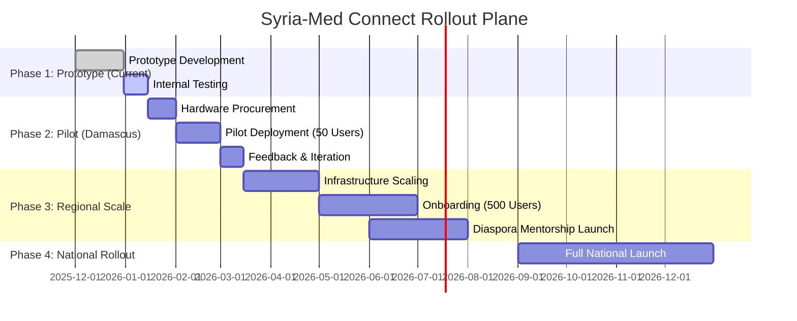

# 🗺️ Strategic Roadmap: Syria-Med Connect

This document outlines the phased rollout plan for the Syria-Med Connect platform, ensuring sustainable deployment in low-resource environments.

## 📅 Execution Timeline (12 Months)

## 📍 Phase Details

### Phase 1: MVP & Verification (Current Status)
- **Goal**: Validate "Offline-First" core technology.
- **Deliverable**: Vue.js PWA + Mock Backend (Completed).
- **Key Metric**: Successful booking transaction without internet connection.

### Phase 2: Clinical Pilot (Months 1-3)
- **Goal**: Test in real-world conditions at Damascus University Hospital.
- **Scope**: 
    - 1 Workshop type ("Emergency Medicine").
    - 50 Medical Students.
    - 1 Admin.
- **Success Criteria**: 90% booking success rate on 3G/Unstable networks.

### Phase 3: Diaspora Integration (Months 4-8)
- **Goal**: Activate the "Brain Circulation" network.
- **Feature**: Video Mentorship Module integration.
- **Partner**: Syrian German Medical Association (SGMA).

### Phase 4: Sustainability (Months 9-12)
- **Goal**: Full hand-off to local administration.
- **Technical**: Migration to local servers (if feasible) or optimized AWS low-bandwidth tier.
